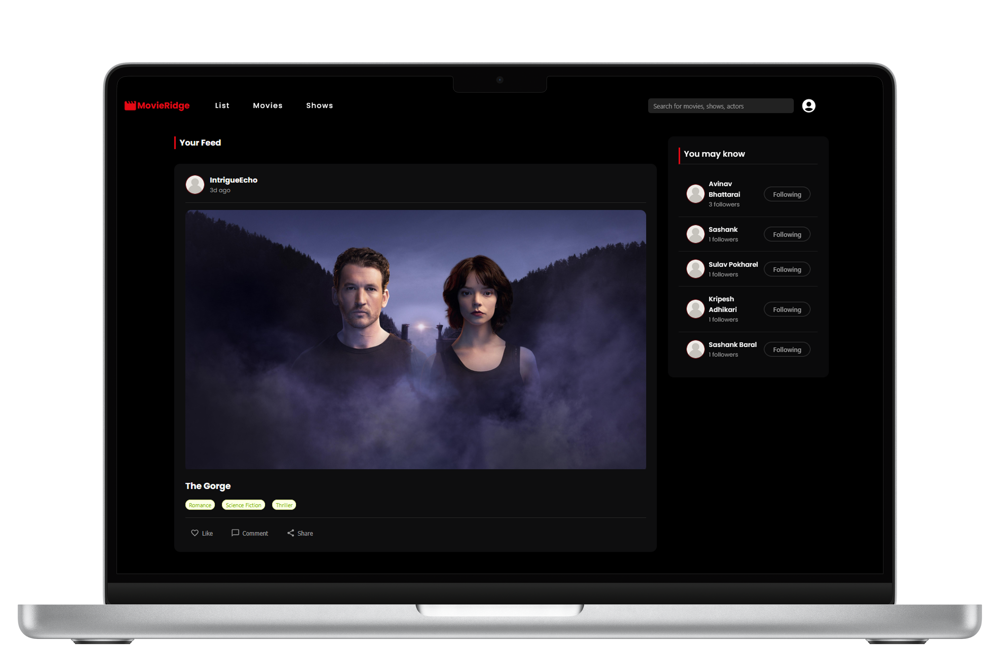
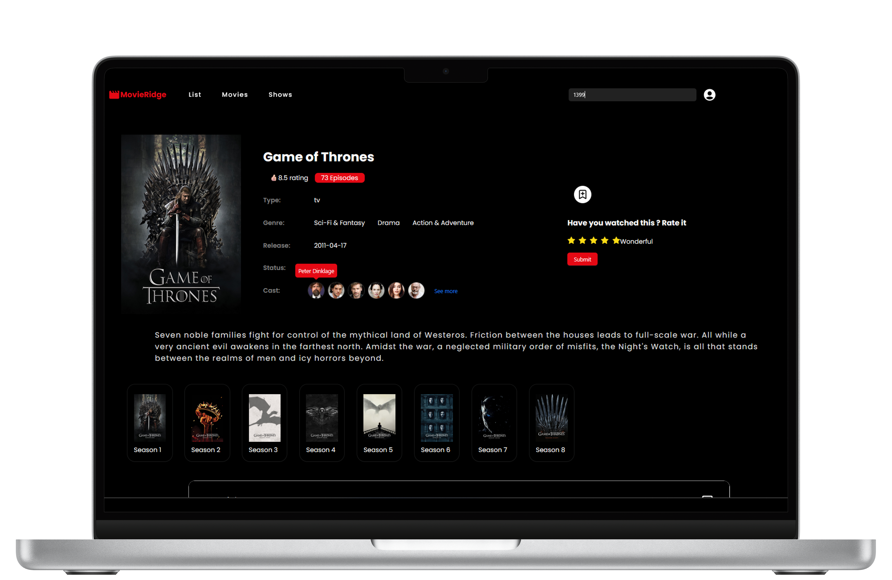

# MovieRidge

  
  

🚀 **MovieRidge** is a social media-based application for movie and TV show enthusiasts, offering personalized recommendations and a platform to share your viewing experiences.

## 📌 Project Description

MovieRidge is designed to enhance your entertainment experience by combining social networking features with personalized recommendations for both movies and TV shows. Our platform allows users to:

- 🎥 **Create and maintain a watch list** of movies and TV shows
- 📝 **Share your favorite films and series** on your feed
- 🎯 **Get personalized recommendations** tailored to your taste
- 🤝 **Connect with friends and fellow entertainment lovers**
- 📺 **Explore a vast library of movies and TV shows** from various providers, including **VidSrc** and **VidSrcPro**

---

## 🌟 Key Features

### 📋 Personalized Watch List
Keep track of all the movies and TV shows you've watched. Rate them, add notes, and revisit your viewing journey anytime.

### 📰 Social Feed
Share the content that left an impression on you. Post about the films or series you loved, write mini-reviews, or simply let your friends know what you're currently watching.

### 🔍 Recommendation Engine
Our sophisticated algorithm analyzes your watching history and preferences to suggest movies and TV shows you're likely to enjoy.

### 🎬 Content Providers Integration
Access a wide range of movies and TV shows through our partnerships with **VidSrc** and **VidSrcPro**, ensuring you always have something great to watch.

### 👥 Friend Connections
Follow your friends, see what they're watching, and discover new content through their recommendations.

### 🎥 WebRTC Implementation
Our broadcasting feature utilizes **WebRTC (Web Real-Time Communication)** technology. This peer-to-peer communication protocol enables **high-quality, low-latency video streaming** directly in the browser, ensuring a smooth and interactive shared viewing experience.

---

## 🔮 Upcoming Features

✨ **Synchronized Playback** – Users will be able to **synchronize their viewing sessions**, pause, play, and discuss the content in real-time.

💬 **Chat Integration** – A built-in **chat system** will allow viewers to discuss the movie or show as they watch, enhancing the social aspect of the platform.

Stay tuned for updates on these exciting new features! 🚀

---

MovieRidge is more than just a content database - it's a **community of entertainment lovers**. Whether you're a casual viewer or a dedicated cinephile, **MovieRidge is your go-to platform** for all things movies and TV shows. Join us in celebrating the art of visual storytelling and discover your next favorite film or series! 🎬🍿

